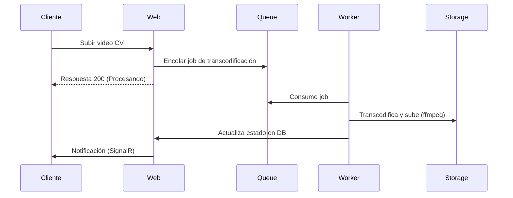

# ChambeaJobs — Documentación completa (versión libro)

Autor: Redblayker
Fecha: 2026-08-18

---

Resumen
-------
Esta documentación expandida describe en detalle la aplicación ChambeaJobs: arquitectura, ejecución, revisión de código con mejoras y optimizaciones concretas, ejemplos de migraciones EF Core y SQL, diagramas mermaid editables, y propuestas de nuevos módulos con pasos de integración. Está pensada para convertirse en PDF (pandoc, GitHub Actions o mkdocs) y como guía de refactor para desarrolladores.

Tabla de contenidos
-------------------
- Capítulo 1: Introducción y alcance
- Capítulo 2: Preparación del entorno y ejecución
- Capítulo 3: Estructura del proyecto y arquitectura
- Capítulo 4: Flujo de ejecución y componentes clave
- Capítulo 5: Revisión de código y recomendaciones de optimización
- Capítulo 6: Migraciones EF Core y scripts SQL de ejemplo
- Capítulo 7: Diagramas (Mermaid)
- Capítulo 8: Nuevos módulos propuestos y plan de integración
- Capítulo 9: Testing, CI/CD y despliegue a producción
- Capítulo 10: Plan de trabajo incremental (roadmap)
- Apéndices: Snippets, plantillas y comandos útiles

Capítulo 1 — Introducción y alcance
----------------------------------
Objetivo
: Proveer una guía técnica exhaustiva que permita a desarrolladores entender, mejorar, escalar y extender ChambeaJobs. Incluye cambios concretos y ejemplos listos para aplicar.

Audiencia
: Desarrolladores backend (.NET), DevOps, arquitectos y responsables de producto.

Alcance
: Código existente (Web, Application, Domain, Infrastructure), mejora de rendimiento, seguridad, escalabilidad, y diseño de nuevos módulos (API, ML, worker de video, cola/event-bus).

Capítulo 2 — Preparación del entorno y ejecución
------------------------------------------------
Requisitos mínimos
- .NET SDK compatible (recomendado .NET 8 o la versión usada en el proyecto).
- SQL Server (local o remoto).
- dotnet-ef (opcional para migraciones): `dotnet tool install --global dotnet-ef`

Variables y secretos
- Usa `dotnet user-secrets` en desarrollo: `dotnet user-secrets init` y `dotnet user-secrets set "Authentication:Google:ClientId" "..."`.
- En producción utiliza Azure Key Vault / AWS Secrets Manager.

Comandos básicos
```bash
# Restaurar paquetes y compilar
dotnet restore
dotnet build

# Ejecutar la web (desde la raíz)
dotnet run --project ChambeaJobs.Web

# Aplicar migraciones (si quieres control manual)
dotnet ef database update --project ChambeaJobs.Infrastructure --startup-project ChambeaJobs.Web
```

Conversión a PDF (sugerencias)
- Pandoc: `pandoc DOCUMENTACION_COMPLETA.md -o DOCUMENTACION_COMPLETA.pdf --metadata title="ChambeaJobs"`
- GitHub Actions: crear workflow que use pandoc o mkdocs-pdf-plugin para generar PDF en cada release.

Capítulo 3 — Estructura del proyecto y arquitectura
---------------------------------------------------
Árbol top-level (resumen)
```text
ChambeaJobs.sln
ChambeaJobs.Web/         # ASP.NET Core MVC + SignalR + HostedServices
ChambeaJobs.Application/ # DTOs, interfaces de servicios, eventos del dominio
ChambeaJobs.Domain/      # Entidades de dominio, enums
ChambeaJobs.Infrastructure/ # EF Core, Repositories, Identity, Services (SMTP, Storage)
ChambeaJobs.Tests/       # Pruebas unitarias e integración
docs/
README.md
```

Pilares arquitectónicos
- Patrón de capas: Web -> Application -> Domain -> Infrastructure.
- UnitOfWork + Repositories para persistencia.
- Event-driven interno: IPublicadorEventos y manejadores registrados.
- Background hosted services para tareas periódicas.
- SignalR para notificaciones y chat en tiempo real.

Capítulo 4 — Flujo de ejecución y componentes clave
---------------------------------------------------
Petición típica (public-facing)
1. Cliente HTTP -> Middleware (seguridad, actualización "ultimo acceso")
2. Routing -> Controller
3. Controller -> Servicio de Application (p. ej. ICandidatoService)
4. Servicio -> Repositorio / DbContext
5. Cambios persistidos en DB / eventos publicados
6. Notificaciones en tiempo real vía SignalR o eventos en bus

Middleware relevante (observaciones)
- Data Protection persistente en App_Data/keys (correcto).
- Actualización de "ultimo acceso" en middleware: actualmente realiza SaveChangesAsync por request (mejora sugerida: encolado y batch-update).
- CSP y headers de seguridad ya aplicados en Program.cs.

Capítulo 5 — Revisión de código y recomendaciones de optimización
------------------------------------------------------------------
Resumen de problemas detectados y correcciones concretas.

5.1 Evitar I/O sincrónico y reducir SaveChanges por request
Problema
: Middleware que actualiza el último acceso llama a SaveChangesAsync potencialmente una vez por request => carga en base de datos.
Solución
: Encolar el userId en un background queue y procesarlo en batch por un HostedService.

Ejemplo: implementación minimalista de cola y worker
```csharp
// IBackgroundUserActivityQueue.cs
public interface IBackgroundUserActivityQueue
{
    void Enqueue(string userId);
    Task<List<string>> DequeueBatchAsync(CancellationToken ct, int maxBatch = 100);
}

// BackgroundUserActivityQueue.cs (simple)
public class BackgroundUserActivityQueue : IBackgroundUserActivityQueue
{
    private readonly Channel<string> _channel = Channel.CreateUnbounded<string>();
    public void Enqueue(string userId) => _channel.Writer.TryWrite(userId);
    public async Task<List<string>> DequeueBatchAsync(CancellationToken ct, int maxBatch = 100)
    {
        var list = new List<string>();
        while (list.Count < maxBatch && await _channel.Reader.WaitToReadAsync(ct))
        {
            while (_channel.Reader.TryRead(out var item)) list.Add(item);
            if (!list.Any()) await Task.Delay(200, ct);
        }
        return list;
    }
}

// UserActivityWorker.cs
public class UserActivityWorker : BackgroundService
{
    private readonly IBackgroundUserActivityQueue _queue;
    private readonly IServiceProvider _sp;
    public UserActivityWorker(IBackgroundUserActivityQueue queue, IServiceProvider sp) { _queue = queue; _sp = sp; }
    protected override async Task ExecuteAsync(CancellationToken stoppingToken)
    {
        while (!stoppingToken.IsCancellationRequested)
        {
            var batch = await _queue.DequeueBatchAsync(stoppingToken, 200);
            if (batch.Count == 0) { await Task.Delay(1000, stoppingToken); continue; }

            using var scope = _sp.CreateScope();
            var db = scope.ServiceProvider.GetRequiredService<ApplicationDbContext>();
            var userIds = batch.Distinct().ToList();
            var users = await db.Users.Where(u => userIds.Contains(u.Id)).ToListAsync(stoppingToken);
            var now = DateTime.UtcNow;
            foreach (var u in users) u.UltimoInicioSesion = now;
            await db.SaveChangesAsync(stoppingToken);
        }
    }
}
```
Registro en Program.cs
```csharp
builder.Services.AddSingleton<IBackgroundUserActivityQueue, BackgroundUserActivityQueue>();
builder.Services.AddHostedService<UserActivityWorker>();
```
Middleware: encolar en vez de SaveChanges
```csharp
if (context.User.Identity?.IsAuthenticated == true)
{
    var usuarioId = context.User.FindFirstValue(ClaimTypes.NameIdentifier);
    if (!string.IsNullOrEmpty(usuarioId))
        context.RequestServices.GetRequiredService<IBackgroundUserActivityQueue>().Enqueue(usuarioId);
}
await next();
```

5.2 Mejoras en EF Core: AsNoTracking y proyecciones
- Usar AsNoTracking() para consultas de solo lectura.
- Proyectar con Select a DTOs para evitar cargar relaciones no necesarias.

Ejemplo
```csharp
// Malo
var vacantes = await _dbContext.Vacantes.Include(v => v.Empresa).ToListAsync();

// Mejor
var vacantes = await _dbContext.Vacantes
    .AsNoTracking()
    .Where(v => v.Publicada)
    .OrderByDescending(v => v.FechaPublicacion)
    .Select(v => new VacanteListDto { Id = v.Id, Titulo = v.Titulo, EmpresaNombre = v.Empresa.Nombre })
    .ToListAsync();
```

5.3 Indices y optimización de consultas
- Revisar queries frecuentes (búsqueda de vacantes, filtrado por empresa, autenticación) y agregar índices en columnas utilizadas en WHERE/ORDER.
- Ejemplo migration snippet para índice:
```csharp
migrationBuilder.CreateIndex(
    name: "IX_Vacantes_EmpresaId_FechaPublicacion",
    table: "Vacantes",
    columns: new[] { "EmpresaId", "FechaPublicacion" });
```

5.4 Manejo de archivos y escalabilidad
- Implementar provider de almacenamiento en la nube (Azure Blob o AWS S3).
- Mantener LocalFileStorageService para desarrollo.

Ejemplo: registro condicional
```csharp
if (Configuration.GetValue<bool>("Storage:UseAzure"))
    builder.Services.AddScoped<IFileStorageService, AzureBlobFileStorageService>();
else
    builder.Services.AddScoped<IFileStorageService, LocalFileStorageService>();
```

5.5 HttpClient y resiliencia
- Usa IHttpClientFactory para llamadas externas y Polly para retries/circuit-breaker en servicios críticos (SMTP, Recaptcha, APIs externas).

Ejemplo
```csharp
builder.Services.AddHttpClient("recaptcha", client => client.BaseAddress = new Uri("https://www.google.com/recaptcha"))
    .AddTransientHttpErrorPolicy(p => p.WaitAndRetryAsync(3, _ => TimeSpan.FromSeconds(2)));
```

5.6 Observabilidad y tracing
- Añadir Serilog con sinks (console, files, seq/elastic).
- Implementar OpenTelemetry para trazas distribuidas si se introduce bus/eventos.

5.7 Seguridad adicional
- Rate limiting para endpoints: `AspNetCoreRateLimit` o middleware personalizado.
- Habilitar Secure cookie policy en producción.

Capítulo 6 — Migraciones EF Core y scripts SQL de ejemplo
---------------------------------------------------------
Ejemplo de migration para tablas clave (simplificado)
```csharp
public partial class CreateVacantesAndEmpresas : Migration
{
    protected override void Up(MigrationBuilder migrationBuilder)
    {
        migrationBuilder.CreateTable(
            name: "Empresas",
            columns: table => new
            {
                Id = table.Column<Guid>(nullable: false),
                Nombre = table.Column<string>(maxLength: 200, nullable: false),
                FechaRegistro = table.Column<DateTime>(nullable: false)
            },
            constraints: table => { table.PrimaryKey("PK_Empresas", x => x.Id); });

        migrationBuilder.CreateTable(
            name: "Vacantes",
            columns: table => new
            {
                Id = table.Column<Guid>(nullable: false),
                Titulo = table.Column<string>(maxLength: 300, nullable: false),
                EmpresaId = table.Column<Guid>(nullable: false),
                FechaPublicacion = table.Column<DateTime>(nullable: false),
                Publicada = table.Column<bool>(nullable: false)
            },
            constraints: table =>
            {
                table.PrimaryKey("PK_Vacantes", x => x.Id);
                table.ForeignKey("FK_Vacantes_Empresas", x => x.EmpresaId, "Empresas", "Id", onDelete: ReferentialAction.Cascade);
            });

        migrationBuilder.CreateIndex(name: "IX_Vacantes_EmpresaId_FechaPublicacion", table: "Vacantes", columns: new[] { "EmpresaId", "FechaPublicacion" });
    }

    protected override void Down(MigrationBuilder migrationBuilder)
    {
        migrationBuilder.DropTable(name: "Vacantes");
        migrationBuilder.DropTable(name: "Empresas");
    }
}
```

Ejemplo SQL para mantenimiento/indices
```sql
-- Crear índice para búsquedas por palabra clave en título
CREATE INDEX IX_Vacantes_Titulo ON Vacantes(Titulo);

-- Estadísticas: comprobar registros por día
SELECT CAST(FechaPublicacion AS DATE) AS Dia, COUNT(*) AS Total
FROM Vacantes
GROUP BY CAST(FechaPublicacion AS DATE)
ORDER BY Dia DESC;
```

Capítulo 7 — Diagramas (Mermaid)
--------------------------------
Incluyo diagramas mermaid que puedes editar en Markdown y renderizar con herramientas compatibles.

Diagrama: Visión general de componentes
```mermaid
flowchart LR
  A[Cliente web/mobile] -->|HTTP| B[ChambeaJobs.Web (MVC/API)]
  B --> C[Servicios de Application]
  C --> D[ChambeaJobs.Infrastructure -> ApplicationDbContext]
  D --> E[(SQL Server)]
  C --> F[IPublicadorEventos] --> G[Message Broker]
  G --> H[Workers / Microservices]
  B --> I[SignalR Hubs]
  H --> J[Azure Blob / S3]
```

Diagrama: Flujo de procesamiento de video


Capítulo 8 — Nuevos módulos propuestos y plan de integración
-----------------------------------------------------------
8.1 API REST/GraphQL pública
- Crear proyecto `ChambeaJobs.Api` con endpoints versionados y JWT para clientes móviles.
- Reusar capas Application/Infrastructure para lógica de negocio.
- Pasos:
  1. `dotnet new webapi -n ChambeaJobs.Api` y añadir referencias a Application/Infrastructure.
  2. Configurar JWT y CORS para dominios móviles.
  3. Crear controllers de recursos (VacantesController, EmpresasController, AuthController).
  4. Documentar con Swagger/OpenAPI.

8.2 Worker de procesamiento de video (transcoding)
- Tecnologías: Dockerized worker (.NET), ffmpeg, RabbitMQ/Azure Queue.
- Pasos:
  1. Introducir Message Broker.
  2. Al subir video: guardar archivo en Storage temporal y encolar job.
  3. Worker procesa y guarda resultado final en Blob Storage.

8.3 Motor de recomendaciones / scoring
- Opciones: ML.NET (in-process) o servicio externo (Python, scikit-learn) para más flexibilidad.
- Entrenamiento offline y endpoint de inferencia.
- Guardar scores en tabla Compatibilidad o cache (Redis).

8.4 Bus de eventos y microservicios
- Sustituir IPublicadorEventos por implementación que publique a Message Broker y crear suscriptores para CRM, Finanzas, Notificaciones.

8.5 Integración de pagos (Stripe) y webhooks
- Usar Stripe.NET, endpoints webhook, validar firmas, emitir PagoRealizadoEvento.

Capítulo 9 — Testing, CI/CD y despliegue
----------------------------------------
Testing recomendado
- Unit tests: xUnit + Moq/FluentAssertions.
- Integration tests: TestServer o una base de datos SQLite en memoria con migraciones reales.
- E2E tests: Playwright o Selenium para flujos críticos (registro, publicar vacante, postulación).

CI con GitHub Actions (ejemplo simplificado)
```yaml
name: CI
on: [push, pull_request]
jobs:
  build:
    runs-on: ubuntu-latest
    steps:
      - uses: actions/checkout@v4
      - uses: actions/setup-dotnet@v4
        with:
          dotnet-version: '8.0.x'
      - run: dotnet restore
      - run: dotnet build --configuration Release --no-restore
      - run: dotnet test --configuration Release --no-build --verbosity normal
```

Generación automática de PDF en releases
- Agregar job que ejecute pandoc o mkdocs-pdf-plugin y suba el PDF como artifact o lo adjunte a la release.

Despliegue a producción (opciones)
- Contenedores: Dockerize Web app + Workers, desplegar en AKS/ECS/Google GKE.
- App Service (Azure) para despliegue rápido, con Azure SQL y Blob Storage.
- Configuración de entornos: usar configuraciones por ambiente y Key Vault para secretos.

Capítulo 10 — Plan de trabajo incremental y estimaciones
--------------------------------------------------------
Sprint 0 (1 semana)
- Preparar infra local (docker-compose con SQL Server, RabbitMQ opcional).
- Añadir background queue para última-actividad y mover SaveChanges.
- Configurar Serilog y HealthChecks.

Sprint 1 (2-3 semanas)
- Migrar almacenamiento a Blob (si decide usar cloud).
- Añadir AsNoTracking y proyecciones en endpoints críticos.
- Tests unitarios para servicios modificados.

Sprint 2 (3-6 semanas)
- Crear ChambeaJobs.Api (endpoints básicos) con JWT.
- Dockerize worker de video y pipeline de colas.

Sprint 3 (4-8 semanas)
- Integrar pagos (Stripe) y webhooks.
- Implementar bus de eventos con broker y mover manejadores a suscriptores.

Apéndice A — Snippets y plantillas útiles
-----------------------------------------
A.1 Plantilla para README de módulo
```markdown
# ChambeaJobs.Api
API REST para ChambeaJobs

## Run
`dotnet run --project ChambeaJobs.Api`
```

A.2 Plantilla GitHub Action para generar PDF con pandoc
```yaml
name: Build docs PDF
on: [push]
jobs:
  build-docs:
    runs-on: ubuntu-latest
    steps:
      - uses: actions/checkout@v4
      - name: Install pandoc
        run: sudo apt-get update && sudo apt-get install -y pandoc
      - name: Build PDF
        run: pandoc DOCUMENTACION_COMPLETA.md -o DOCUMENTACION_COMPLETA.pdf --pdf-engine=xelatex
      - name: Upload artifact
        uses: actions/upload-artifact@v4
        with:
          name: docs-pdf
          path: DOCUMENTACION_COMPLETA.pdf
```

A.3 Checklist pre-despliegue
- [ ] Secrets en Key Vault
- [ ] TLS obligatorio
- [ ] Backups de base de datos
- [ ] Monitoreo y alertas
- [ ] Pruebas E2E pasadas

Fin
---

Notas finales
-------------
He generado una versión completa y expandida en este archivo. Si quieres que incluya diagramas adicionales (por ejemplo: class diagrams de Domain.Entities, sequence diagrams más detallados), o que convierta automáticamente este MD a PDF y lo suba como artifact en un workflow de GitHub Actions, puedo hacerlo en el siguiente paso.

Si confirmas, procederé a guardar este archivo como `DOCUMENTACION_COMPLETA.md` en la rama por defecto del repositorio `Redblayker/ChambeaJobs`.
